# k-Nearest Neighbors

## *useful (but not interesting) functions*

* Here, I just define some functions used for making demo plots during the introduction.

* Feel free to look at them later (especially if you are not familiar with `numpy` and `matplotlib`).

* But now let's skip them.


```python
# numpy and matplotlib will be used a lot during the lecture
# if you are familiar with these libraries you may skip this part
# if not - extended comments were added to make it easier to understand

# it is kind of standard to import numpy as np and pyplot as plt
import numpy as np
import matplotlib.pyplot as plt

# used later to apply different colors in for loops
mpl_colors = ('r', 'b', 'g', 'c', 'm', 'y', 'k', 'w')

# just to overwrite default colab style
plt.style.use('default')
plt.style.use('seaborn-talk')


def generate_random_points(size=10, low=0, high=1):
  """Generate a set of random 2D points
  
  size -- number of points to generate
  low  -- min value
  high -- max value
  """
  # random_sample([size]) returns random numbers with shape defined by size
  # e.g.
  # >>> np.random.random_sample((2, 3))
  #
  # array([[ 0.44013807,  0.77358569,  0.64338619],
  #        [ 0.54363868,  0.31855232,  0.16791031]])
  #
  return (high - low) * np.random.random_sample((size, 2)) + low


def init_plot(x_range=None, y_range=None, x_label="$x_1$", y_label="$x_2$"):
  """Set axes limits and labels
  
  x_range -- [min x, max x]
  y_range -- [min y, max y]
  x_label -- string
  y_label -- string
  """
 
  # subplots returns figure and axes
  # (in general you may want many axes on one figure)
  # we do not need fig here
  # but we will apply changes (including adding points) to axes
  _, ax = plt.subplots(dpi=70)
  
  # set grid style and color
  ax.grid(c='0.70', linestyle=':')
  
  # set axes limits (x_range and y_range is a list with two elements)
  ax.set_xlim(x_range) 
  ax.set_ylim(y_range)
    
  # set axes labels
  ax.set_xlabel(x_label)
  ax.set_ylabel(y_label)
  
  # return axes so we can continue modyfing them later
  return ax


def plot_random_points(style=None, color=None):
  """Generate and plot two (separated) sets of random points
  
  style -- latter group points style (default as first)
  color -- latter group color (default as first)
  """
  
  # create a plot with x and y ranges from 0 to 2.5
  ax = init_plot([0, 2.5], [0, 2.5])

  # add two different sets of random points
  # first set = 5 points from [0.5, 1.0]x[0.5, 1.0]
  # second set = 5 points from [1.5, 2.0]x[1.5, 2.0]
  # generate_random_points return a numpy array in the format like
  # [[x1, y1], [x2, y2], ..., [xn, yn]]
  # pyplot.plt take separately arrays with X and Y, like
  # plot([x1, x2, x3], [y1, y2, y3])
  # thus, we transpose numpy array to the format
  # [[x1, x2, ..., xn], [y1, y2, ..., yn]]
  # and unpack it with *
  ax.plot(*generate_random_points(5, 0.5, 1.0).T, 'ro')
  ax.plot(*generate_random_points(5, 1.5, 2.0).T, style or 'ro')
  
  return ax


def plot_an_example(style=None, color=None, label="Class"):
  """Plot an example of supervised or unsupervised learning"""
  ax = plot_random_points(style, color)

  # circle areas related to each set of points
  # pyplot.Circle((x, y), r); (x, y) - the center of a circle; r - radius
  # lw - line width
  ax.add_artist(plt.Circle((0.75, 0.75), 0.5, fill=0, color='r', lw=2))
  ax.add_artist(plt.Circle((1.75, 1.75), 0.5, fill=0, color=color or 'r', lw=2))

  # put group labels
  # pyplot.text just put arbitrary text in given coordinates
  ax.text(0.65, 1.4, label + " I", fontdict={'color': 'r'})
  ax.text(1.65, 1.1, label + " II", fontdict={'color': color or 'r'})
```

## Our first ML problem

* Two classes: red circles and blue squares (**training** samples)

* Where does the green triangle (**test** sample) belong?


```python
X1 = generate_random_points(20, 0, 1)
X2 = generate_random_points(20, 1, 2)

new_point = generate_random_points(1, 0, 2)

plot = init_plot([0, 2], [0, 2])  # [0, 2] x [0, 2]

plot.plot(*X1.T, 'ro', *X2.T, 'bs', *new_point.T, 'g^');
```


## Nearest Neighbor

* The nearest neigbor classifier *compares* a test sample with all training samples to predict a label (class).

* How to compare two samples?

    * L1 distance: $d(\vec x_1, \vec x_2) = \sum\limits_i |x_1^i - x_2^i|$

    * L2 distance: $d(\vec x_1, \vec x_2) = \sqrt{\sum\limits_i (x_1^i - x_2^i)^2}$
    
        * note: in practice square root is ignored (becasue is monotonic function)
        
        * L2 is less forgiving than L1 - prefers many small disagreements than one big one
  
    * cosine distance (cosine similarity): $d(\vec x_1, \vec x_2) = \frac{x_1 \cdot x_1}{||\vec x_1|| \cdot ||\vec x_2||}$

    * Chebyshev distance: $d(\vec x_1, \vec x_2) = max_i(|x_1^i - x_2^i|)$
    
    * and many others
    
* The closest one determines the test sample label

### Implementation

* The implementation of nearest neighbor algorithm is pretty straightforward

* There is no real training process here - we just need to remember all training feature vectors and corresponding labels

* To predict a label for new sample we just need to find the label of the closest point from training samples


```python
class NearestNeighbor():
  """Nearest Neighbor Classifier"""
  
  def __init__(self, distance=0):
    """Set distance definition: 0 - L1, 1 - L2"""
    if distance == 0:
      self.distance = np.abs     # absolute value
    elif distance == 1:
      self.distance = np.square  # square root
    else:
      raise Exception("Distance not defined.")
    
  
  def train(self, x, y):
    """Train the classifier (here simply save training data)
    
    x -- feature vectors (N x D)
    y -- labels (N x 1)
    """
    self.x_train = x
    self.y_train = y
    

  def predict(self, x):
    """Predict and return labels for each feature vector from x
    
    x -- feature vectors (N x D)
    """
    predictions = []  # placeholder for N labels
    
    # loop over all test samples
    for x_test in x:
      # array of distances between current test and all training samples
      distances = np.sum(self.distance(self.x_train - x_test), axis=1)
      
      # get the closest one
      min_index = np.argmin(distances)
      
      # add corresponding label
      predictions.append(self.y_train[min_index])

    return predictions
```

### The magic of numpy

* NumPy is irreplacable tool for numerical operations on arrays

* Using numpy we could easily find all distances using one line

```
distances = np.sum(self.distance(self.x_train - x_test), axis=1)

```

* Here is how it works


```python
# let's create an array with 5x2 shape
a = np.random.random_sample((5, 2))

# and another array with 1x2 shape
b = np.array([[1., 1.]])

print(a, b, sep="\n\n")
```

    [[0.79036457 0.36571819]
     [0.76743991 0.08439684]
     [0.56876884 0.97967839]
     [0.77020776 0.21238365]
     [0.94235534 0.73884472]]
    
    [[1. 1.]]


```python
# subtract arguments (element-wise)
# note, that at least one dimension must be the same 
print(a - b)
```

    [[-0.20963543 -0.63428181]
     [-0.23256009 -0.91560316]
     [-0.43123116 -0.02032161]
     [-0.22979224 -0.78761635]
     [-0.05764466 -0.26115528]]


```python
# numpy.abs calculates absolute value (element-wise)
print(np.abs(a - b))
```

    [[0.20963543 0.63428181]
     [0.23256009 0.91560316]
     [0.43123116 0.02032161]
     [0.22979224 0.78761635]
     [0.05764466 0.26115528]]


```python
# sum all elements
np.sum(np.abs(a - b))
```


    3.7798417848539096


```python
# sum elements over a given axis
np.sum(np.abs(a - b), axis=0)
```


    array([1.16086358, 2.61897821])


```python
np.sum(np.abs(a - b), axis=1)
```


    array([0.84391724, 1.14816326, 0.45155276, 1.01740859, 0.31879994])


### Analysis

* Before we start using `NearestNeighbor` let's create a simple mini-framework to apply NN and visualize results easily

* We want to initilize `NearestNeighbor` with some feature vectors (and automatically assign labels for each class)

* We want our test samples to be a grid of uniformly distributed points

* We want methods to process test data and to make a plots with final results


```python
class Analysis():
  """Apply NearestNeighbor to generated (uniformly) test samples."""
  
  def __init__(self, *x, distance):
    """Generate labels and initilize classifier
    
    x -- feature vectors arrays
    distance -- 0 for L1, 1 for L2    
    """
    # get number of classes
    self.nof_classes = len(x)
    
    # create lables array
    # np.ones creates an array of given shape filled with 1 of given type
    # we apply consecutive integer numbers as class labels
    # ravel return flatten array
    y = [i * np.ones(_x.shape[0], dtype=np.int) for i, _x in enumerate(x)]
    y = np.array(y).ravel()

    # save training samples to plot them later
    self.x_train = x
    
    # merge feature vector arrays for NearestNeighbor
    x = np.concatenate(x, axis=0)
    
    # train classifier
    self.nn = NearestNeighbor(distance)
    self.nn.train(x, y)
        
    
  def prepare_test_samples(self, low=0, high=2, step=0.01):
    """Generate a grid with test points (from low to high with step)"""
    # remember range
    self.range = [low, high]
    
    # start with grid of points from [low, high] x [low, high]
    grid = np.mgrid[low:high+step:step, low:high+step:step]
    
    # convert to an array of 2D points
    self.x_test = np.vstack([grid[0].ravel(), grid[1].ravel()]).T
    
  
  def analyse(self):
    """Run classifier on test samples and split them according to labels."""
    
    # find labels for test samples 
    self.y_test = self.nn.predict(self.x_test)
    
    self.classified = []  # [class I test points, class II test ...]
    
    # loop over available labels
    for label in range(self.nof_classes):
      # if i-th label == current label -> add test[i]
      class_i = np.array([self.x_test[i] \
                          for i, l in enumerate(self.y_test) \
                          if l == label])
      self.classified.append(class_i)
  
  
  def plot(self, t=''):
    """Visualize the result of classification"""
    plot = init_plot(self.range, self.range)
    plot.set_title(t)
    plot.grid(False)
    
    # plot training samples
    for i, x in enumerate(self.x_train):
      plot.plot(*x.T, mpl_colors[i] + 'o')
      
    # plot test samples
    for i, x in enumerate(self.classified):
      plot.plot(*x.T, mpl_colors[i] + ',')
```

### L1 test


```python
l1 = Analysis(X1, X2, distance=0)
l1.prepare_test_samples()
l1.analyse()
l1.plot()
```


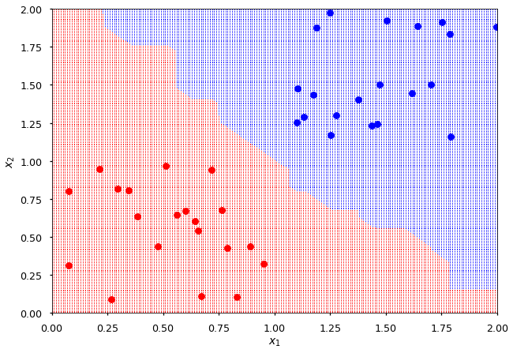


### L2 Test


```python
l2 = Analysis(X1, X2, distance=1)
l2.prepare_test_samples()
l2.analyse()
l2.plot()
```


### Multiclass classification

* Training samples from 4 squares:

    * [0, 1] x [0, 1]
    * [0, 1] x [1, 2]
    * [1, 2] x [0, 1]
    * [1, 2] x [1, 2]
    
* We expect 4 squares created by test samples grid

* How does it depend on the size of training samples?


```python
def generate4(n=50):
  """Generate 4 sets of random points."""
  
  # points from [0, 1] x [0, 1]
  X1 = generate_random_points(n, 0, 1)
  # points from [1, 2] x [1, 2]
  X2 = generate_random_points(n, 1, 2)
  # points from [0, 1] x [1, 2]
  X3 = np.array([[x, y+1] for x,y in generate_random_points(n, 0, 1)])
  # points from [1, 2] x [0, 1]
  X4 = np.array([[x, y-1] for x,y in generate_random_points(n, 1, 2)])

  return X1, X2, X3, X4
```


```python
# loop over no. of training samples
for n in (5, 10, 50, 100):
  # generate 4 sets of random points (each one with n samples)
  # unpack them when passing to Analysis
  c4 = Analysis(*generate4(n), distance=1)
  c4.prepare_test_samples()
  c4.analyse()
  c4.plot("No. of samples = {}".format(n))
```


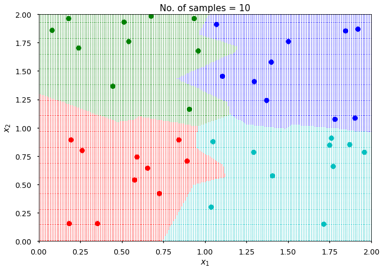


<font color=red size=5>Message 01: size matters!</font>

### Noise


* Data are rarely perfect and you may expect some training samples to have unsual features

* Features shared by a majority of training samples are more important than a single occurrence

* Let's add some noise to our data and see how Nearest Neighbor deal with it


```python
# generate 4 classes of 2D points
X1, X2, X3, X4 = generate4()

# add some noise by applying gaussian to every point coordinates
noise = lambda x, y: [np.random.normal(x, 0.1), np.random.normal(y, 0.1)]

X1 = np.array([noise(x, y) for x, y in X1])
X2 = np.array([noise(x, y) for x, y in X2])
X3 = np.array([noise(x, y) for x, y in X3])
X4 = np.array([noise(x, y) for x, y in X4])

# perform analysis
c4 = Analysis(X1, X2, X3, X4, distance=1)
c4.prepare_test_samples()
c4.analyse()
c4.plot()
```


### Overfitting

* The above is an example of overfitting

    * perfectly describe training data
    * lose the generalization ability

* In general you want to extract all common features from training samples, but neglect characteristic features of single sample
  
<font color=red size=5>Message 02: avoid overfitting!</font>

### Accuracy

* Accuracy defines the fraction of (unseen) samples which are correctly classify by the algorithm 


```python
accuracy = 0

# loop over (sample, reconstructed label)
for sample, label in zip(c4.x_test, c4.y_test):
  # determine true label
  if sample[0] < 1 and sample[1] < 1:
    true_label = 0
  elif sample[0] > 1 and sample[1] > 1:
    true_label = 1
  elif sample[0] < 1 and sample[1] > 1:
    true_label = 2
  else:
    true_label = 3
    
  if true_label == label: accuracy += 1
    
accuracy /= len(c4.x_test)

print(accuracy)
```

    0.924878097076805


* Please note, that this is a toy model - in the case of real problems there is no way to determine true labels (otherwise there is no point to use ML methods...)

* To measure accuracy of the model one usually splits data into:

    * training samples (usually about 80%)

    * test samples (usually about 20%)
  
* After the model is trained on training samples, the accuracy is measured on test samples

<font color=red size=5>Message 03: keep some data for testing!</font>

## k-Nearest Neighbors

* Instead of letting one closest neighbor to decide, let *k* nearest neghbors to vote

### Implementation

* We can base the implementation on `NearestNeighbor`, but

* The *constructor* has an extra parameter *k*

* and we need to override `predict` method


```python
class kNearestNeighbors(NearestNeighbor):
  """k-Nearest Neighbor Classifier"""
  
  
  def __init__(self, k=1, distance=0):
    """Set distance definition: 0 - L1, 1 - L2"""
    super().__init__(distance)
    self.k = k
    
  
  def predict(self, x):
    """Predict and return labels for each feature vector from x
    
    x -- feature vectors (N x D)
    """
    predictions = []  # placeholder for N labels
    
    # no. of classes = max label (labels starts from 0)
    nof_classes = np.amax(self.y_train) + 1
    
    # loop over all test samples
    for x_test in x:
      # array of distances between current test and all training samples
      distances = np.sum(self.distance(self.x_train - x_test), axis=1)
      
      # placeholder for labels votes
      votes = np.zeros(nof_classes, dtype=np.int)
            
      # find k closet neighbors and vote
      # argsort returns the indices that would sort an array
      # so indices of nearest neighbors
      # we take self.k first
      for neighbor_id in np.argsort(distances)[:self.k]:
        # this is a label corresponding to one of the closest neighbor
        neighbor_label = self.y_train[neighbor_id]
        # which updates votes array
        votes[neighbor_label] += 1
                
      # predicted label is the one with most votes
      predictions.append(np.argmax(votes))

    return predictions
```

### kAnalysis

* We also create `kAnalysis` based on `Analysis` for visualization of kNN results


```python
class kAnalysis(Analysis):
  """Apply kNearestNeighbor to generated (uniformly) test samples."""
  
  def __init__(self, *x, k=1, distance=1):
    """Generate labels and initilize classifier
    
    x -- feature vectors arrays
    k -- number of nearest neighbors
    distance -- 0 for L1, 1 for L2    
    """
    # get number of classes
    self.nof_classes = len(x)
    
    # create lables array
    y = [i * np.ones(_x.shape[0], dtype=np.int) for i, _x in enumerate(x)]
    y = np.array(y).ravel()

    # save training samples to plot them later
    self.x_train = x
    
    # merge feature vector arrays for NearestNeighbor
    x = np.concatenate(x, axis=0)
    
    # train classifier (knn this time)
    self.nn = kNearestNeighbors(k, distance)
    self.nn.train(x, y)
```

### Sanity check

* k-Nearest Neighbor classifier with *k = 1* must give exactly the same results as Nearest Neighbor


```python
# apply kNN with k=1 on the same set of training samples
knn = kAnalysis(X1, X2, X3, X4, k=1, distance=1)
knn.prepare_test_samples()
knn.analyse()
knn.plot()
```


### k-Test

* For *k = 1* kNN is likely to overfit the problem

* Although, it does not mean that higher *k* is better!

* Now, let's see how different values of *k* affects the result

* Later, we will learn how to find optimal value of *k* for given problem


```python
# training size = 50
# let's check a few values between 1 and 50
for k in (1, 5, 10, 50):
  knn = kAnalysis(X1, X2, X3, X4, k=k, distance=1)
  knn.prepare_test_samples()
  knn.analyse()
  knn.plot("k = {}".format(k))
```


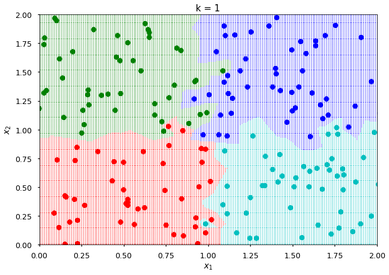


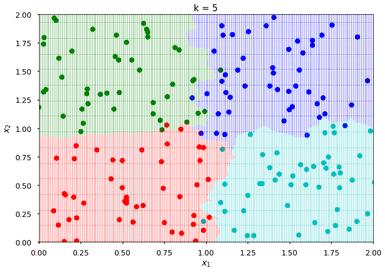


## Hyperparameters

* ML model may have some hyperparameters - parameters set before training

* Please note, ML algorithm may have also parameters which are set during training

* In the case of kNN there are two hyperparameters:

    * number of nearest neihgbors (*k*)

    * the definition of distance

* The choice of hyperparameters values highly depends on a problem

* The wrong choice of hyperparameters may lead to underfitting or overfitting

### Over-, under-fitting example


```python
# generate random data from x^2 function (with some noise)
data = np.array([[x, np.random.normal(x**2, 0.1)] \
                 for x in 2*np.random.random(10) - 1])

plot = init_plot([-1, 1], [-1, 1])
plot.plot(*data.T, 'o');
```


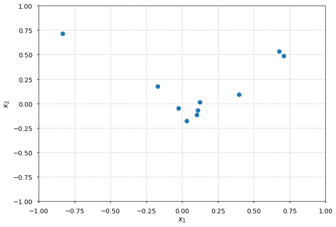


* Let's try to fit this data to a polynomial

* The degree is a hyperparamter (which defines number of coefficients)


```python
# loop over degrees of polynomial
# data is x^2, so let's try degrees 1, 2, 10
for n in (1, 2, 10):
  # polyfit returns an array with polynomial coefficients
  # poly1d is a polynomial class
  f = np.poly1d(np.polyfit(*data.T, n))
  
  # returns an array with 100 uniformly distributed numbers from -1 to 1
  x = np.linspace(-1, 1, 100)

  plot = init_plot([-1, 1], [-1, 1])
  plot.set_title("n = {}".format(n))
  plot.plot(*data.T, 'o', x, f(x))
```

    /usr/local/lib/python3.6/dist-packages/ipykernel_launcher.py:4: RankWarning: Polyfit may be poorly conditioned
      after removing the cwd from sys.path.


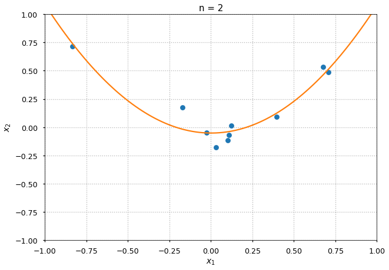


* For *n = 1* we clearly underfit the data as we do not have enough parameters to describe the complexity of the problem

* For *n = 2* we have appropriate capacity (as we actually generated data form $x^2$ function)

* For *n = 10* we overfit the data - training samples are described perfectly, but we clearly lost the generalization ability

<font color=red size=5>Message 04: right choice of hyperparameters is crucial!</font>

### Validation dataset

* One splits data into training and test samples

    * training samples are used to optimize model parameters
    
    * test samples are used to measure accuracy
    
    * there is no rule of thumb on how to split dataset

* If a model has some hyperparameters the part of training set is used for valitation samples:

    * training samples - tuning model parameters
    
    * validation samples - tuning hyperparameters
  
```
                  +---------------------+      +------------------------+
+----------+      |                     |      |                        |
|          |      | Measure accuracy on |      | Measure final accuracy |
| Training | +--> |                     | +--> |                        |
|          |      | validation samples  |      | on test samples        |
+----------+      |                     |      |                        |
     ^            +----------+----------+      +------------------------+
     |                       |
     |      Change           | 
     +-----------------------+
         hyperparameters
```

## Iris dataset

* The data set contains 3 classes of 50 instances each, where each class refers to a type of iris plant. One class is linearly separable from the other 2; the latter are NOT linearly separable from each other. [src](https://archive.ics.uci.edu/ml/datasets/iris)

* Attribute Information:

    * sepal length in cm
    
    * sepal width in cm
    
    * petal length in cm
    
    * petal width in cm
    
    * class: 

        * Iris Setosa
        
        * Iris Versicolour
        
        * Iris Virginica

### Load dataset

* We use `pandas` for data manipulation - it is super handy and supports many formats


```python
import pandas as pd

# columns names - can be used to access columns later
columns = ["Sepal Length", "Sepal Width",
           "Petal Length", "Petal Width",
           "Class"]

# iris.data is a csv file
src = "https://archive.ics.uci.edu/ml/machine-learning-databases/iris/iris.data"

# load the file with pandas.read_csv 
# it will name columns as defined in columns list
# so one can access a column through index or name
iris_data = pd.read_csv(src, header=None, names=columns)
```


```python
iris_data.head()  # print a few first entries
```


<div>
<style scoped>
    .dataframe tbody tr th:only-of-type {
        vertical-align: middle;
    }

    .dataframe tbody tr th {
        vertical-align: top;
    }

    .dataframe thead th {
        text-align: right;
    }
</style>
<table border="1" class="dataframe">
  <thead>
    <tr style="text-align: right;">
      <th></th>
      <th>Sepal Length</th>
      <th>Sepal Width</th>
      <th>Petal Length</th>
      <th>Petal Width</th>
      <th>Class</th>
    </tr>
  </thead>
  <tbody>
    <tr>
      <th>0</th>
      <td>5.1</td>
      <td>3.5</td>
      <td>1.4</td>
      <td>0.2</td>
      <td>Iris-setosa</td>
    </tr>
    <tr>
      <th>1</th>
      <td>4.9</td>
      <td>3.0</td>
      <td>1.4</td>
      <td>0.2</td>
      <td>Iris-setosa</td>
    </tr>
    <tr>
      <th>2</th>
      <td>4.7</td>
      <td>3.2</td>
      <td>1.3</td>
      <td>0.2</td>
      <td>Iris-setosa</td>
    </tr>
    <tr>
      <th>3</th>
      <td>4.6</td>
      <td>3.1</td>
      <td>1.5</td>
      <td>0.2</td>
      <td>Iris-setosa</td>
    </tr>
    <tr>
      <th>4</th>
      <td>5.0</td>
      <td>3.6</td>
      <td>1.4</td>
      <td>0.2</td>
      <td>Iris-setosa</td>
    </tr>
  </tbody>
</table>
</div>


### Visualize dataset

* `pandas` offers plotting through `matplotlib` integration

* Let's visualize Iris data

* Let's keep the code short - sorry if it is hard to follow


```python
# to extract rows with class column == class_name
extract = lambda class_name: iris_data.loc[iris_data['Class'] == class_name]

# axes settings - part = Sepal or Petal; x = Length, y = Width
set_ax = lambda part: {"x": part + " Length",
                       "y": part + " Width",
                       "kind": "scatter"}

# add iris type / sepal or petal / color to existing axis
plot = lambda class_name, part, color, axis: \
  extract(class_name).plot(**set_ax(part),
                           color=color,
                           label=class_name,
                           ax=axis)
  
# plot all Iris types (sepal or petal) on existing axis
plot_all = lambda part, axis: \
  [plot(iris, part, mpl_colors[i], axis) \
   for i, iris in enumerate(set(iris_data['Class']))] 
```


```python
# with pyplot.subplots we can create many plots on one figure
# here we create 2 plots - 1 row and 2 columns
# thus, subplots returns figure, axes of 1st plot, axes for 2nd plot
_, (ax1, ax2) = plt.subplots(1, 2, figsize=(9,4))

# using messy lambda we can plot all Iris types at once
# Petal data on 1st plots and Sepal data on 2nd plot
plot_all("Petal", ax1)
plot_all("Sepal", ax2)

# tight_layout adjust subplots params so they fit into figure ares
plt.tight_layout()
```


### Prepare feature vectors and labels

* First step is to prepare data - we need feature vectors with corresponding labels

* In this case every sample's feature vector is 4D (sepal length, sepal width, petal length, petal width) and is labeled with one of three classes (Iris Setosa, Iris Versicolour, Iris Virginica)


```python
# every Iris has 4 features (forming our 4D feature vectors)
# pandaoc.DataFrame.iloc allows us access data through indices
# we create an array with feature vectors by taking all rows for first 4 columns
X = iris_data.iloc[:, :4]

# it is still pandoc.DataFrame object - pretty handy
X.head()
```


<div>
<style scoped>
    .dataframe tbody tr th:only-of-type {
        vertical-align: middle;
    }

    .dataframe tbody tr th {
        vertical-align: top;
    }

    .dataframe thead th {
        text-align: right;
    }
</style>
<table border="1" class="dataframe">
  <thead>
    <tr style="text-align: right;">
      <th></th>
      <th>Sepal Length</th>
      <th>Sepal Width</th>
      <th>Petal Length</th>
      <th>Petal Width</th>
    </tr>
  </thead>
  <tbody>
    <tr>
      <th>0</th>
      <td>5.1</td>
      <td>3.5</td>
      <td>1.4</td>
      <td>0.2</td>
    </tr>
    <tr>
      <th>1</th>
      <td>4.9</td>
      <td>3.0</td>
      <td>1.4</td>
      <td>0.2</td>
    </tr>
    <tr>
      <th>2</th>
      <td>4.7</td>
      <td>3.2</td>
      <td>1.3</td>
      <td>0.2</td>
    </tr>
    <tr>
      <th>3</th>
      <td>4.6</td>
      <td>3.1</td>
      <td>1.5</td>
      <td>0.2</td>
    </tr>
    <tr>
      <th>4</th>
      <td>5.0</td>
      <td>3.6</td>
      <td>1.4</td>
      <td>0.2</td>
    </tr>
  </tbody>
</table>
</div>


* `pandas.DataFrame` object are handy to manipulate data, but at the end of the day we want to perform algebra with `numpy`


```python
# create numpy array (matrix) for further processing
X = np.array(X)

# print a few first entries
print(X[:5])
```

    [[5.1 3.5 1.4 0.2]
     [4.9 3.  1.4 0.2]
     [4.7 3.2 1.3 0.2]
     [4.6 3.1 1.5 0.2]
     [5.  3.6 1.4 0.2]]


* from the las column ("Class") we create our labels


```python
# as mentioned before, we can access DataFrame object through column labels
Y = np.array(iris_data["Class"])

# print a few first entries
print(Y[:5])
```

    ['Iris-setosa' 'Iris-setosa' 'Iris-setosa' 'Iris-setosa' 'Iris-setosa']


### Prepare test dataset

* Let's use 80% for training and 20% for testing

* We, obviously, can not just take last 20% of samples for testing because our data is ordered

* But we can randomly select 20% of samples

* Easy to do by hand, but let's start to use some ML frameworks


```python
from sklearn.model_selection import train_test_split as split

# train_test_split: Split arrays or matrices into random train and test subsets
X_train, X_test, Y_train, Y_test = split(X, Y, test_size=0.2)

# let's use 20% of training samples for validation
X_train, X_valid, Y_train, Y_valid = split(X_train, Y_train, test_size=0.2)

# check how many sample we have
print(X_train.shape[0], X_valid.shape[0], X_test.shape[0])
```

    96 24 30


### kNN from scikit-learn

* `scikit-learn` has already implemented k-Nearest Neighbor algorithm (which is more flexible than the one implemented during this lecture)

* Let's see how *complicated* is using one of ML frameworks with Python


```python
from sklearn.neighbors import KNeighborsClassifier

# create knn classifier with k = 48
knn = KNeighborsClassifier(n_neighbors=48)

# train the model
knn.fit(X_train, Y_train)

# predict labels for test samples
Y_pred = knn.predict(X_valid)
```

### Accuracy

* First let's print true labels along with predicted ones


```python
# use bold if true != predicted
for true, pred in zip(Y_valid, Y_pred):
  if pred == true:
    print("{}\t -> {}".format(true, pred))
  else:
    print("\033[1m{}\t -> {}\033[0m".format(true, pred))
```

    Iris-setosa	 -> Iris-setosa
    Iris-versicolor	 -> Iris-versicolor
    Iris-setosa	 -> Iris-setosa
    Iris-versicolor	 -> Iris-versicolor
    Iris-virginica	 -> Iris-virginica
    Iris-virginica	 -> Iris-virginica
    Iris-versicolor	 -> Iris-virginica
    Iris-virginica	 -> Iris-virginica
    Iris-versicolor	 -> Iris-versicolor
    Iris-setosa	 -> Iris-setosa
    Iris-virginica	 -> Iris-virginica
    Iris-versicolor	 -> Iris-versicolor
    Iris-virginica	 -> Iris-virginica
    Iris-virginica	 -> Iris-versicolor
    Iris-virginica	 -> Iris-virginica
    Iris-virginica	 -> Iris-virginica
    Iris-versicolor	 -> Iris-versicolor
    Iris-setosa	 -> Iris-setosa
    Iris-setosa	 -> Iris-setosa
    Iris-virginica	 -> Iris-virginica
    Iris-virginica	 -> Iris-versicolor
    Iris-setosa	 -> Iris-setosa
    Iris-versicolor	 -> Iris-versicolor
    Iris-virginica	 -> Iris-versicolor


* We can easily calculate accuracy by hand as it is just a number of correctly predicted labels divided by no. of samples


```python
# Y_valid == Y_pred -> array of True/False (if two elements are equal or not)
# (Y_valid == Y_pred).sum() -> number of Trues
# Y_valid.shape[0] -> number of validation samples
accuracy = (Y_valid == Y_pred).sum() / Y_valid.shape[0]

print(accuracy)
```

    0.8333333333333334


* But we can also use `scikit-learn` function `accuracy_score`


```python
from sklearn.metrics import accuracy_score

print(accuracy_score(Y_valid, Y_pred))
```

    0.8333333333333334


### k-dependence of the accuracy

* Let's use validation set to determine the best hyperparameter *k*

* We will run kNN for various values of *k* and measure accuracy

* This will allow us to find the optimal value of *k*

* And check the accuracy on the test dataset


```python
scores = []  # placeholder for accuracy

max_k = 85  # maximum number of voters

# loop over different values of k
for k in range(1, max_k):
  # create knn classifier with k = k
  knn = KNeighborsClassifier(n_neighbors=k)

  # train the model
  knn.fit(X_train, Y_train)

  # predict labels for test samples
  Y_pred = knn.predict(X_valid)
  
  # add accuracy to score table
  scores.append(accuracy_score(Y_valid, Y_pred))
```

* Now, we can plot accuracy as a function of *k*


```python
def k_accuracy_plot(max_k=85):
  """Just plot settings"""
  plt.grid(True)
  plt.xlabel("k")
  plt.ylabel("Accuracy")
  plt.xlim([0, max_k + 5])
  plt.ylim([0, 1])
  plt.xticks(range(0, max_k + 5, 5))
  
  return plt

k_accuracy_plot().plot(range(1, max_k), scores);
```


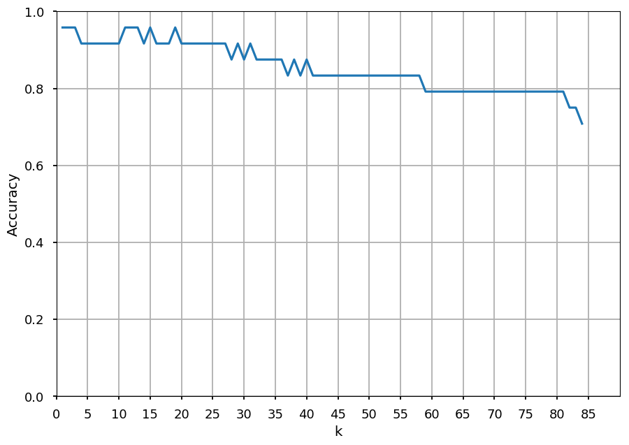


* And check the accuracy measured on the test samples


```python
knn = KNeighborsClassifier(n_neighbors=9)
knn.fit(X_train, Y_train)
Y_pred = knn.predict(X_test)
  
print(accuracy_score(Y_test, Y_pred))
```

    0.9666666666666667


* The accuracy plot is not smooth

* It is common if one does not have enough validation samples

* But there is another way to measure accuracy dependence on hyperparameters

### Cross-validation

```
         Split training samples into N folds

 +-------+   +-------+   +-------+         +-------+
 |       |   |       |   |       |         |       |
 |   1   |   |   2   |   |   3   |   ...   |   N   |
 |       |   |       |   |       |         |       |
 +-------+   +-------+   +-------+         +-------+

Take one fold as validation set and train on N-1 folds

 +-------+   +-------+   +-------+         +-------+
 |*******|   |       |   |       |         |       |
 |*******|   |   2   |   |   3   |   ...   |   N   |
 |*******|   |       |   |       |         |       |
 +-------+   +-------+   +-------+         +-------+

         Take the next one as validation set

 +-------+   +-------+   +-------+         +-------+
 |       |   |*******|   |       |         |       |
 |   1   |   |*******|   |   3   |   ...   |   N   |
 |       |   |*******|   |       |         |       |
 +-------+   +-------+   +-------+         +-------+

          Repeat the procedure for all folds

 +-------+   +-------+   +-------+         +-------+
 |       |   |       |   |       |         |*******|
 |   1   |   |   2   |   |   3   |   ...   |*******|
 |       |   |       |   |       |         |*******|
 +-------+   +-------+   +-------+         +-------+

            And average out the accuracy
```

* Once again `scikit-learn` has already implemented the procedure we need


```python
from sklearn.model_selection import cross_val_score

# this time we do not create dedicated validation set
X_train, X_test, Y_train, Y_test = split(X, Y, test_size=0.2)

avg_scores = []  # average score for different k

nof_folds = 10

# loop over different values of k
for k in range(1, max_k):
  # create knn classifier with k = k
  knn = KNeighborsClassifier(n_neighbors=k)

  # cross-validate knn on our training sample with nof_folds
  scores = cross_val_score(knn, X_train, Y_train,
                           cv=nof_folds, scoring='accuracy')
  
  # add avg accuracy to score table
  avg_scores.append(scores.mean())
```


```python
k_accuracy_plot().plot(range(1, max_k), avg_scores);
```


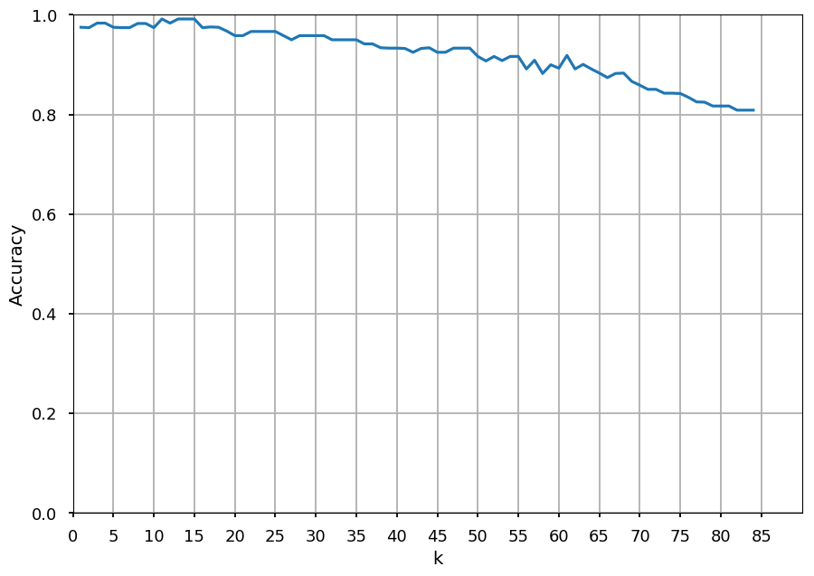


* In theory, k-fold cross-validation is the way to go (especially if a dataset is small)

* In practice, people tend to use a single validation split as it is not that computational expensive

### Data normalization

* Sometimes there is a need to preprocess data before training

* Let's imagine Iris sepal data is in cm but petal data in mm


```python
# original data - both in cm
print(X[:5])
```

    [[5.1 3.5 1.4 0.2]
     [4.9 3.  1.4 0.2]
     [4.7 3.2 1.3 0.2]
     [4.6 3.1 1.5 0.2]
     [5.  3.6 1.4 0.2]]


```python
# make a copy of X
Xmm = X.copy()

# and multiply last two columns by 0.1
Xmm[:,2:] *= 0.1

# and we have our fake Iris data with petal length/width in mm
print(Xmm[:5])
```

    [[5.1  3.5  0.14 0.02]
     [4.9  3.   0.14 0.02]
     [4.7  3.2  0.13 0.02]
     [4.6  3.1  0.15 0.02]
     [5.   3.6  0.14 0.02]]


* Let's compare result of the same classifier on both dataset


```python
def get_accuracy(X, Y, k=10):
  """Make training and test datasets and process through kNN"""
  
  # prepare training / test samples
  X_train, X_test, Y_train, Y_test = split(X, Y, test_size=0.2)

  # create a kNN with k = k
  knn = KNeighborsClassifier(n_neighbors=k)

  # get prediction for original dataset
  knn.fit(X_train, Y_train)
  Y_pred = knn.predict(X_test)
  
  return accuracy_score(Y_test, Y_pred)

cm = get_accuracy(X, Y)
mm = get_accuracy(Xmm, Y)

print("Accuracy:\n\tboth in cm: {}\n\tpetal in mm: {}".format(cm, mm))
```

    Accuracy:
    	both in cm: 1.0
    	petal in mm: 0.7


* It is kind of obvious here - petal information will barely contribute to the distance

* However, it is not always obvious if some features are not suppressed by the way data is normalized

<font color=red size=5>Message 05: be aware of data normalization!</font>

## MNIST

* [THE MNIST DATABASE of handwritten digits](http://yann.lecun.com/exdb/mnist/)

* *The MNIST database of handwritten digits, available from this page, has a training set of 60,000 examples, and a test set of 10,000 examples. It is a subset of a larger set available from NIST. The digits have been size-normalized and centered in a fixed-size image.*

* *It is a good database for people who want to try learning techniques and pattern recognition methods on real-world data while spending minimal efforts on preprocessing and formatting.*

---

* To make it simpler (and faster) let's use digits toy dataset which comes with `scikit-learn` [src](http://scikit-learn.org/stable/modules/generated/sklearn.datasets.load_digits.html)

* Each datapoint is a 8x8 image of a digit.

* About 180 samples per class (digit)

* Total number of samples 1797

### Load digits


```python
from sklearn.datasets import load_digits

digits = load_digits()

print(digits.data.shape)
```

    (1797, 64)


* `digits.images` is a `numpy` array with 1797 `numpy` arrays 8x8 (feature vectors) representing digits

* `digits.target` is a `numpy` array with 1797 integer numbers (class labels)

* the code below allow us to visualize a random digits from the dataset


```python
# set grayscale
plt.gray()

# get some random index from 0 to dataset size
random_index = np.random.randint(1796)


# draw random digit
plt.matshow(digits.images[random_index])

# and print the matrix
plt.text(8, 5, digits.images[random_index],
         fontdict={'family': 'monospace', 'size': 16})

# and the label
plt.text(10, 1, "This is: {}".format(digits.target[random_index]),
         fontdict={'family': 'monospace', 'size': 16});
```


    <matplotlib.figure.Figure at 0x7faccc90a048>


### Distance between images

```
  TEST      TRAIN    PIXEL-WISE
| 4 2 0     2 5 8 |   |2 3 8|
| 5 3 9  -  2 8 1 | = |3 5 8|  ->  38
| 0 2 3     1 4 9 |   |1 2 6|
```

### Prepare data

* We need to split dataset to training and test samples

* However, images are in 8x8 format and we have to flatten them first


```python
# the original shape of an image
print(digits.images.shape)
```

    (1797, 8, 8)


```python
# numpy.reshape is handy here
print(digits.images.reshape((1797, -1)).shape)
```

    (1797, 64)


* Please note -1 in new shape

* `numpy.reshape` allows us to pass one *unknown* dimension which can be determined automatically

* Thus, the above is equivalent to


```python
print(digits.images.reshape((1797, 64)).shape)
```

    (1797, 64)


```python
print(digits.images.reshape((-1, 64)).shape)
```

    (1797, 64)


* As before, we can split our dataset using `sklearn.model_selection.train_test_split`


```python
data_train, data_test, label_train, label_test = \
  split(digits.images.reshape((1797, -1)), digits.target, test_size=0.2)
```

### Cross-validation

* We perform cross-validation on training samples to determine the best *k* (as for the Iris dataset)


```python
avg_scores = []  # average score for different k

max_k = 50
nof_folds = 10

# loop over different values of k
for k in range(1, max_k):
  # create knn classifier with k = k
  knn = KNeighborsClassifier(n_neighbors=k)

  # cross-validate knn on our training sample with nof_folds
  scores = cross_val_score(knn, data_train, label_train,
                           cv=nof_folds, scoring='accuracy')
  
  # add avg accuracy to score table
  avg_scores.append(scores.mean())
```


```python
plt.grid(True)
plt.xlabel("k")
plt.ylabel("Accuracy")
plt.xlim([0, max_k])
plt.ylim([0, 1])
plt.xticks(range(0, max_k, 5))
  
plt.plot(range(1, max_k), avg_scores);
```


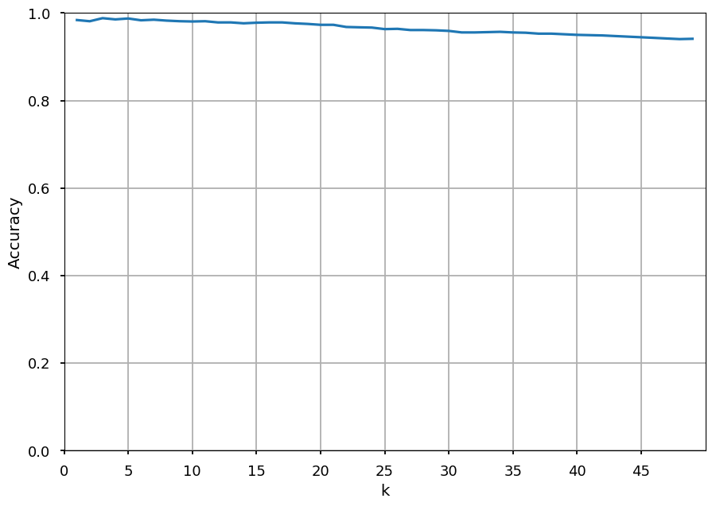


* We used nearly the same procedure as for the Iris dataset

* Note, that digits toy dataset prefer different *k*

* This is the idea of ML - the same algorithm can solve different problems if train on different data

* Nowadays, in ML field **data is more important than algorithms** (we have good algorithms already) 

### Final test

* Let's take the bes *k* and check how the classifier works on test samples


```python
from sklearn.metrics import accuracy_score

knn = KNeighborsClassifier(n_neighbors=1)
knn.fit(data_train, label_train)
prediction = knn.predict(data_test)

print(accuracy_score(label_test, prediction))
```

    0.9888888888888889


* We can take a look at misclassified digits


```python
for i, (true, predict) in enumerate(zip(label_test, prediction)):
  if true != predict:
    digit = data_test[i].reshape((8, 8))  # reshape again to 8x8
    plt.matshow(digit)                    # for matshow
    plt.title("{} predicted as {}".format(true, predict))
```


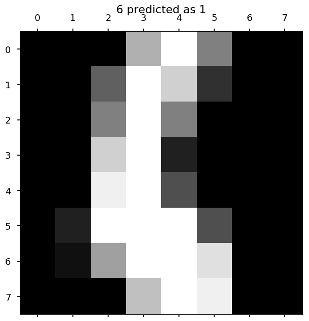


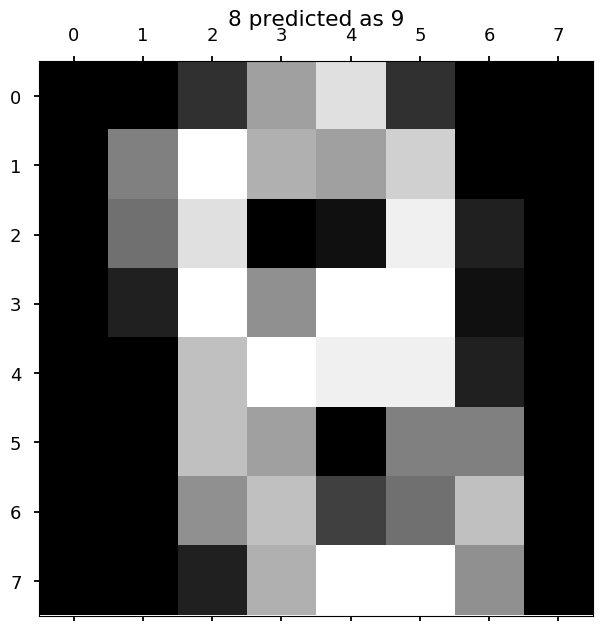


## Regression with kNN

* It is also possible to do regression using k-Nearest Neighbors

    * find *k* nearest neighbors from training samples
    
    * calculate the predicted value using inverse distance weighting method
  
    $$y_{pred}(\vec x) = \frac{\sum\limits_i w_i(\vec x) y_{train, i}}{\sum\limits_i w_i(\vec x_i)}$$
  
    * where $w_i(\vec x) = \frac{1}{d(\vec x, \vec x_{train, i})}$
    
    * Note, that $y_{pred}(\vec x) = y_{train, i}$ if $d(\vec x, \vec x_{train, i}) = 0$

### Genearate some fake data

* Let's grab some random points from the sine function

* And add some noise to make it more like real data


```python
data_size = 50

# generate and sort *data_size* numbers from 0 to 4pi 
x_train = 4 * np.pi * np.sort(np.random.rand(data_size, 1), axis=0)

# let's fit to sine  
y_train = np.sin(x_train).ravel()

# add some noise to the data
y_train = np.array([np.random.normal(y, 0.05) for y in y_train])

plt.plot(x_train, y_train, 'ro');
```


### Make a fit

* In general, one should do cross-validation to determine the best *k*

* We will skip this part during the lecture (feel free to check this at home though!)

* Let's just check how kNN fit works for a few different values of *k*

### Comment on `numpy.newaxis`


```python
# let's create a 1D numpy array
D1 = np.array([1, 2, 3, 4])

print(D1)
```

    [1 2 3 4]


```python
# we can easily add another dimension using numpy.newaxis
D2 = D1[:, np.newaxis]

print(D2)
```

    [[1]
     [2]
     [3]
     [4]]


### And back to the task

* We use kNN regressor from `scikit-learn` (from intro: *What I really do...*)


```python
from sklearn.neighbors import KNeighborsRegressor

# first we need test sample
x_test = np.linspace(0, 4*np.pi, 100)[:, np.newaxis]

for i, k in enumerate((1, 5, 10, 20)):
  # weights=distance - weight using distances
  knn = KNeighborsRegressor(k, weights='distance')
  
  # calculate y_test for all points in x_test
  y_test = knn.fit(x_train, y_train).predict(x_test)
  
  plt.subplot(2, 2, i + 1)

  plt.title("k = {}".format(k))
  
  plt.plot(x_train, y_train, 'ro', x_test, y_test, 'g');
  
plt.tight_layout()
```


## Summary

* We have learned first ML algorithm - k-Nearest Neighbors

* It has some pros:

    * easy to understand and implement

    * no time needed for training - may be used for initial analysis before one reaches for some *heavier* tool
    
    * solves nonlinear problems 
    
    * limited number of hyperparameters
    
    * no parameters!
    
    * *at the end of this lecture we will deal with tens of hyperparameters and thousands of parameters*

* Although cons make it hard to use in practice

    * training data must be kept for the whole time (so called **lazy training**)
    
        * imagine having GB of training samples and you want to make mobile app
        
        * other algorithms allows to discard training samples once the model is trained (**eager learning**) - usually it means long training process but super fast classification (which is what we really want)
  
    * distance-comparing is not suitable for all data - a picture of a cat on a blue background (e.g. sky) can be close to a ship on a sea (because background pixels vote too)

        * e.g. for [CIFAR-10](https://www.cs.toronto.edu/~kriz/cifar.html) (60k pictures, 10 classes, more about that later) vanilla kNN get less than 40% accuracy

      * still better than random guessing (10%), but convolutional neural networks get >95%

* Still, we have learned from kNN a few important things:

    * Data is important (both size and quality)
    
    * Sometimes data requires preprocessing
    
    * Wrong choice of hyperparameters may lead to under- or over-fitting
        
        * Use validation samples to tune the model
        
        * And **DO NOT** touch test samples until you are done!    
